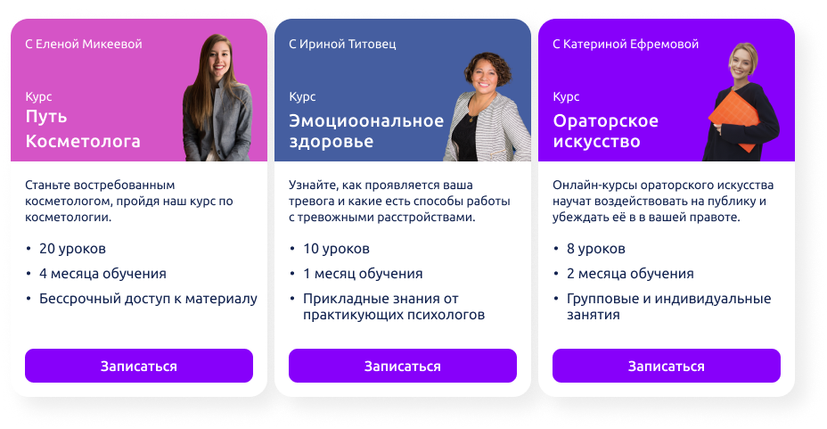
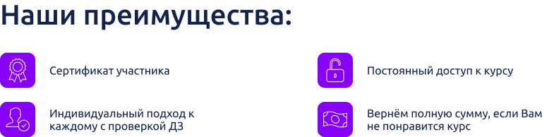
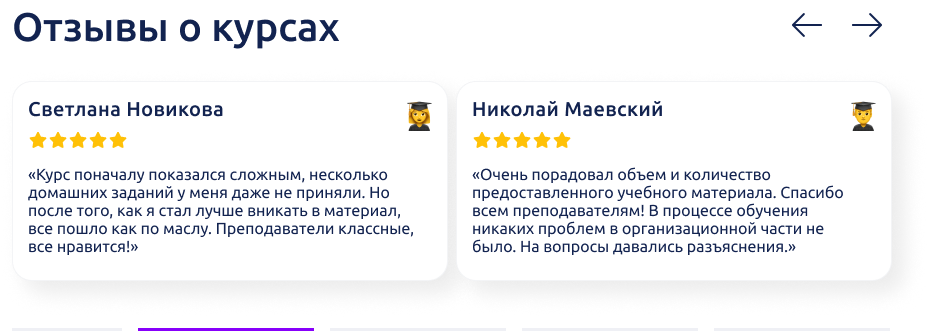

# Zero Academy
----
## __1) Цели__
##### Создание образовательной онлайн платформы, для людей всех возрастов. 
## __2) Визуализация__
##### ___Цвета:___ должны быть приятными для глаза и побуждать к саморазвитию. 
#
##### ___Стиль:___  Flat design. 
#
##### ___Адаптивность:___ Так же, сайтом должно быть удобно пользоваться как на ПК, так и на смартфонах, так как планируется пользование курсами и на телефонах. Следовательно адаптив должен быть.
## __3) Структура__
##### У сайта есть две главный страницы:
- ##### Презинтация
- ##### Курсы
##### ___Презинтация___ - Эта страница будет открываться первой, должен он дробиться на эти блоки:
- ##### __Приветствие__ (Само приветствие, и две кнопки навигации "Ролик" и "Начать")
- ##### __Популярные курсы__ (Фото куратора, заголовок, подзаголовок, время обучения, цена со скидкой, ) 

- ##### __Перчисление преимуществ__

- ##### __Отзывы__

## 4) Приложение
##### Наши главные конкуренты: 
- ##### https://skillbox.ru
- ##### https://www.codecademy.com/
- ##### https://stepik.org/catalog
- ##### https://skillfactory.ru/
- ##### https://netology.ru/
